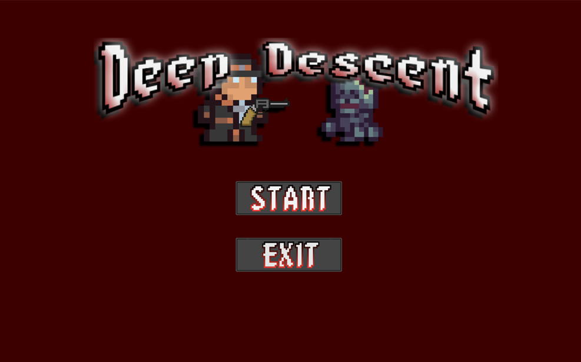
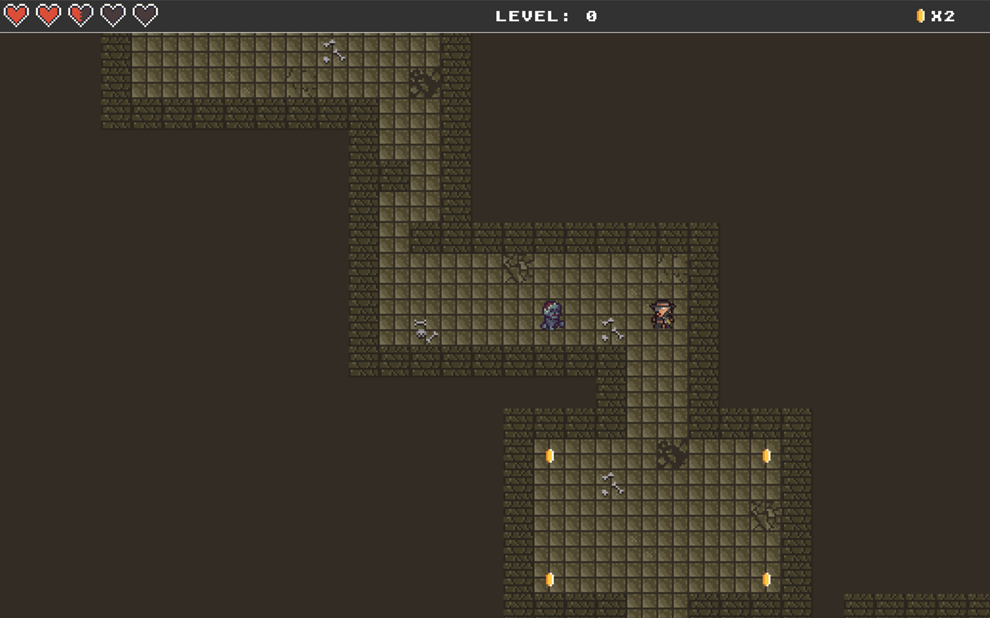
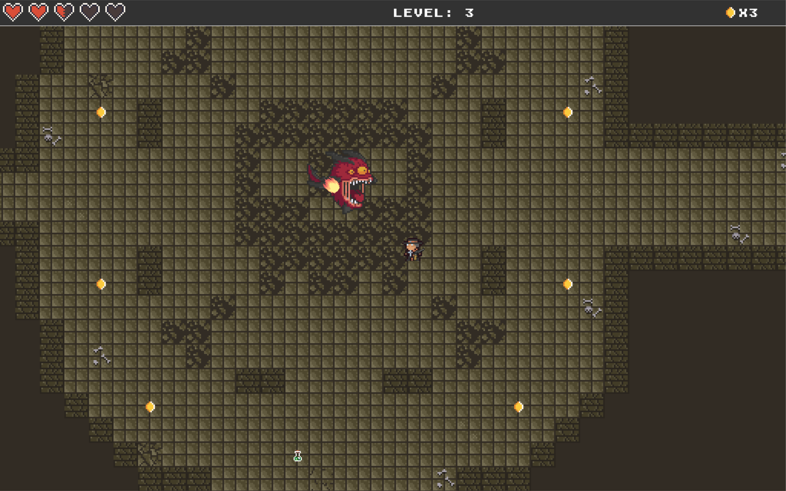

# Deep Descent 🗡️🕯️  
A 2D dungeon crawler built with Pygame

Deep Descent is a small 2D dungeon-crawler game where you explore dungeon levels, fight enemies, collect coins, and survive long enough to reach the next floor. The game contains **3 levels total**, and the **final level features a boss fight**.

---

## 🎮 Gameplay Overview
You control a character moving through dungeon rooms and corridors. Along the way you’ll:
- battle enemies using your pistol,
- collect **coins**,
- manage your **health**,
- pick up **health potions** when your HP gets low,
- advance through **3 levels**, ending with a **boss** on the final level.

---

## ✨ Features
- 2D top-down dungeon crawler gameplay  
- **3 levels** (final level includes a **boss**)  
- Health system + **health potions** for recovery  
- Enemy combat (weapon-based)  
- Coin collection  
- Simple start menu

---

## 🖼️ Screenshots

  
  


---

## ✅ Requirements
- **Python 3.13**
- **Pygame**

---

## 🎮 Controls
- **Move:** `W A S D` 
- **Shoot:** `Left Mouse Button`
- **Pause / Menu:** `ESC`
  
---

## ▶️ How to Run
```bash
pip install pygame
python main.py
